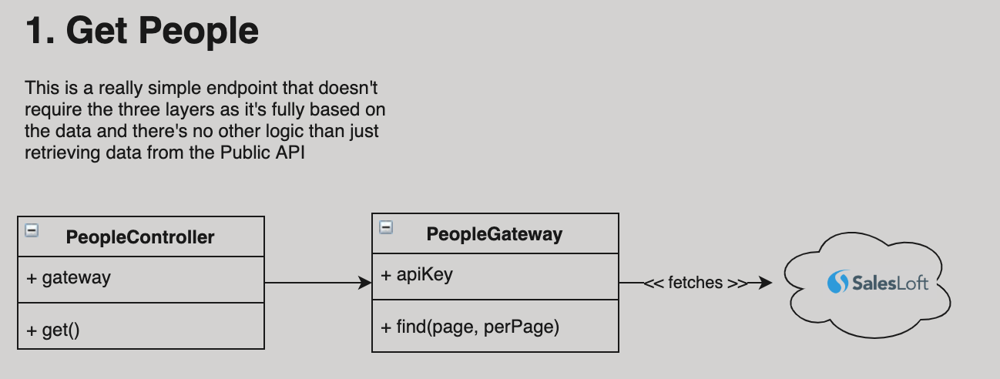
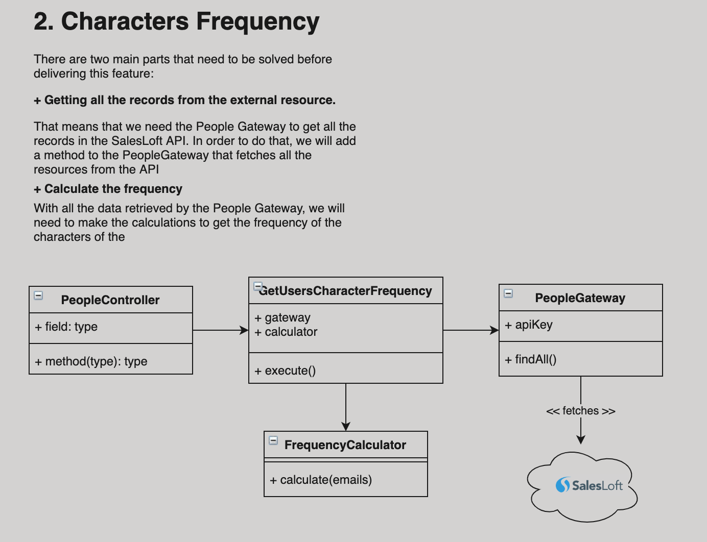
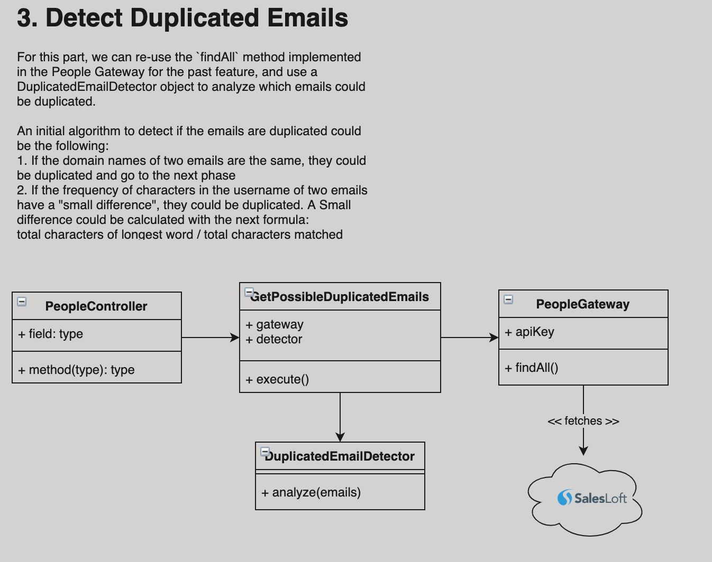

# Technical Spec

## Goals
- **List of Users**: Display a list of users with the following information:
  - Name
  - Email Address
  - Job Title
- **Characters Frequency** Calculate the frequency of all characters in people emails
  - Display a table with the frequency
- **Duplicated Emails** Create an algorithm to identify possible duplicated emails

## Context
The application requires to have both Front End and Back End code, so it means the back end code will be responsible of fetch the resources from the Public API by performing the authentication mechanism and the necessary logic to implement the goals of this project, and the Front End will just draw the results by doing API requests to the back end.

The API Key authentication simplifies a lot the authentication process as the only thing required to do is to insert the key provided by the challenge to the Authorization Header in the HTTP Request.

Let's dive a little more about how to get people through the endpoint.

### API - Get People
Some information about the endpoint:

URL: https://api.salesloft.com/v2/people.json
Configurable params:
  - page
  - per_page

Based on the response that the API throws, the required information can be found in the following fields with the following names:

```json
{
  "id": 101693889,
  "created_at": "2018-03-13T00:39:59.820272-04:00",
  "updated_at": "2018-03-13T00:39:59.820272-04:00",
  ...

  "display_name": "Orlando Stanton",
  "email_address": "katrina_langosh@kozey.io",
  "title": "Regional Factors Specialist"
}
```

As the people resource has the options to paginate, the front end will need to have a paginator component to change between pages.

## Solution
So, let's dive into what we need to do to achieve the challenge goals.

### _Back End_
For an initial design, it would make sense to have three logic layers for this application.

1. **Delivery Mechanism - HTTP Endpoints**:
The Delivery Mechanism is the layer of the system where a Client (in this case, the Front End) requests an operation to be performed into the system, without the need of knowing the internal structure of the system.
This will be the part of the system where the HTTP Controllers will live.

2. **Domain Logic Layer - Use Cases**:
The Domain Logic Layer will be responsible of orchestrate the `Entity Gateway` and core modules to return a result to the controllers so they can format that information for delivery purposes (returning information to the Front End)

3. **Entity Gateway**:
The Entity Gateway will have the responsibility of fetching information from an external resource gateway (Public API) and decouple the `how to retrieve data` from the use cases, so if the data gateway retrieves information from other source like a SQL Database, a Document Database, or even File System, the Use Cases do not need to change. This is achieved by exposing a well defined interface so that the clients doesn't know internal information about the `how` and they just know the `what`.

Watching an overall design of the back end system with the respective use cases:

#### People List


#### Characters Frequency


#### Duplicated Emails



### _Front End_
For the front end side, we can design a very simple 20/80 layout, similar to Jira or Confluence Layout, with a sidebar and the content section, having the following options in the sidebar:
- People
- Characters Frequency
- Duplicated Emails

So, the first selected option in the sidebar will be `People` by default, and when the other sections are selected, they will display the corresponding information

#### People List
For this section, a grid of 4 elements per row can be displayed for each person entity.

#### Characters Frequency
For this section, a table can be displayed, showing the characters frequency, where one column is for the characters and the other is for the frequency number.

#### Duplicated Emails
For this section, a list can be displayed where each item in the list contains the similar words.

A very simple Vue.js application could be used to handle the whole state of this application
